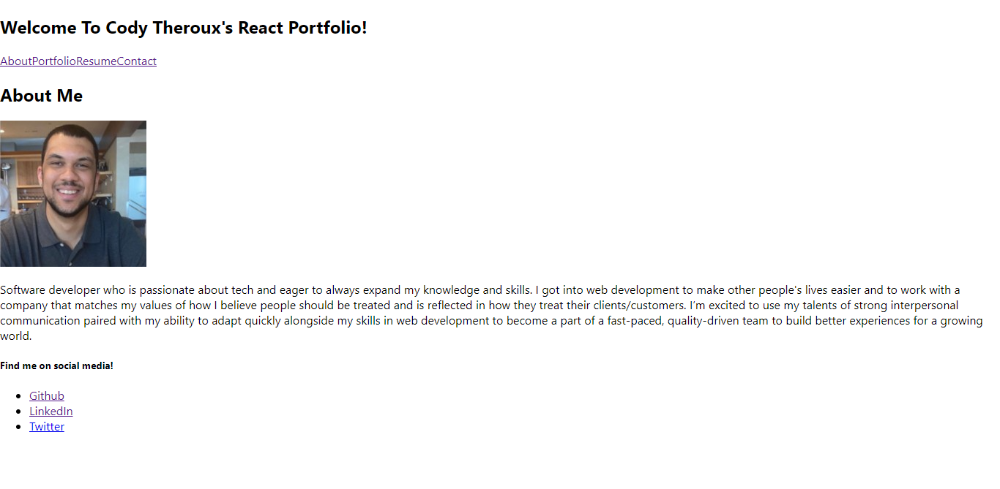

# React Portfolio

## Table of Contents
- [Description](#description)
- [Visuals](#visuals)
- [Resources](#resources)
- [Questions](#questions)

## Description
This is a simple application that highlights the parts of a portfolio. Although it contains no styling it demonstrates the usage of components and use state in react when toggling between sections of the portfolio.
## Visuals

## Resources
- [Live Site](https://quiet-river-08951.herokuapp.com/ )
- [Repo](https://github.com/codytheroux96/react-portfolio)

## Questions
If you have any questions feel free to reach out to me at: cody.theroux3@gmail.com

